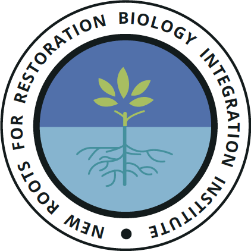
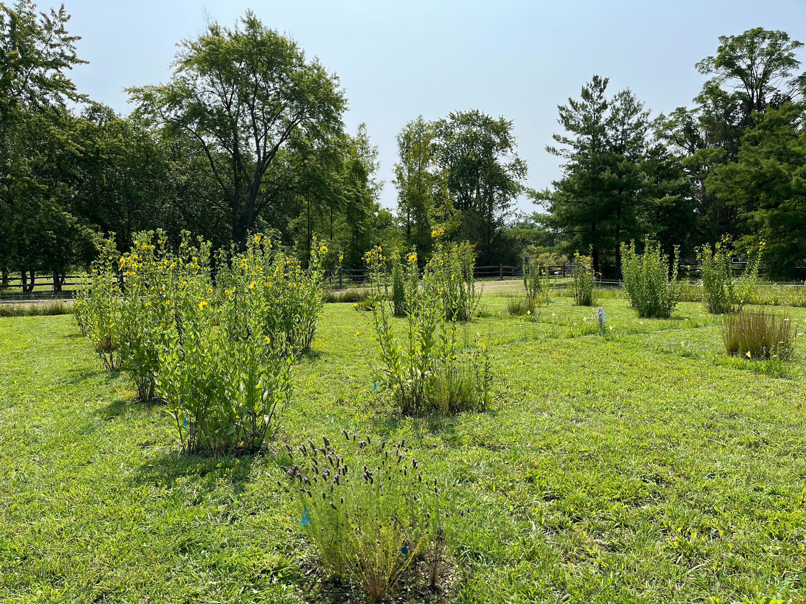

I use experimental and meta-analyses to address the conservation of culturally significant plants in urban environments such as agriculture, and urban restoration. I also research biocultural restoration in tallgrass restorations, BIPOC restoration practices in the US. I also explore how trait variation varies in population sources of restoration materials and how that affects function and interactions.

Our team created the Black Earth Restoration Collective (BERC) and launced in 2024. BERC is a collective of Black, Indigenous, and People of Color (BIPOC) working closely with plants. We intend to cultivate this collective to center BIPOC perspectives, and to be a place for members to engage, discuss, support, and collaborate on topics in restoration and related topics (agriculture, plant-related research, sustainability, and ways these areas affect BIPOC communities). Please see the [BERC website](https://aliciafoxx.github.io/berc/about.html) with more information and how to join.

{: style="height:150px;width:150px;"}

I am also a part of the [New Roots for Restoration](https://newroots.squarespace.com/) (NSF Biological Integration Institute) - a cross disciplinary team across nine institutions with the aim of adding to the knowledge of perennial agriculture and native plant selection by understanding how root and shoot traits are interrelated and how the soil biotic and edaphic properties influence these relationships. Below is an image of our field site in Mettawa, IL.

{: style="display: block; margin: auto; height:600px; width:650px"}

Image courtesy of Liz Vogel

Works include:

[Shifting dynamics in restoration ecology: Concrete steps towards centering Black, Indigenous, and People of Color's communities and perspectives](https://besjournals.onlinelibrary.wiley.com/doi/full/10.1002/2688-8319.12345)

[Multigenerational invasive plant competition causes greater root than shoot trait shifts in a perennial grass](https://link.springer.com/article/10.1007/s11258-024-01446-1)

[Why are some plant species missing from restorations? A diagnostic tool for temperate grassland ecosystems](https://www.frontiersin.org/journals/conservation-science/articles/10.3389/fcosc.2022.1028295/full)

[Intraspecific functional trait structure of restoration‐relevant species: implications for restoration seed sourcing](https://besjournals.onlinelibrary.wiley.com/doi/pdfdirect/10.1111/1365-2664.13603)

[Population differentiation in early life history traits of Cleome lutea var. lutea in the Intermountain West](https://bioone.org/journals/western-north-american-naturalist/volume-76/issue-1/064.076.0103/Population-Differentiation-in-Early-Life-History-Traits-of-iCleome-lutea/10.3398/064.076.0103.short)

[Variation in number of root tips influences survival in competition with an invasive grass](https://www.sciencedirect.com/science/article/abs/pii/S0140196320300938)

[Hidden variation: cultivars and wild plants differ in trait variation with surprising root trait outcomes](https://onlinelibrary.wiley.com/doi/abs/10.1111/rec.13336)
