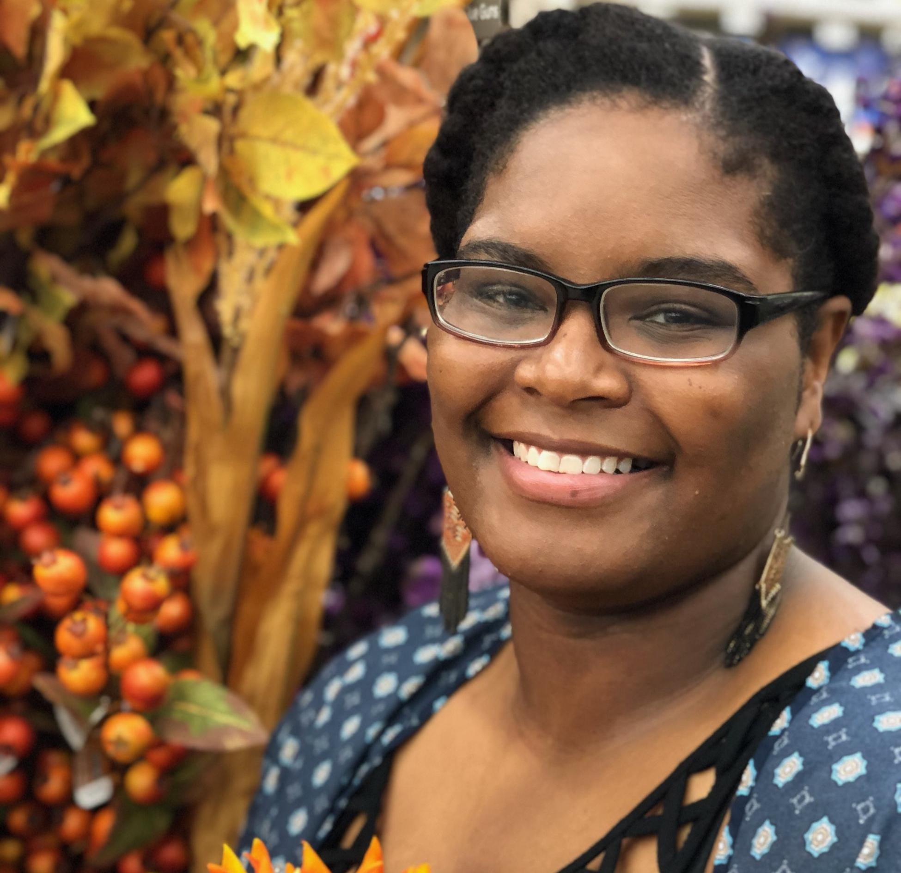

# The Foxx Disrupting Ecology Lab

My name is Alicia Foxx and I work to make science better and how I can give back to my community through my work.

I'm a Conservation Scientist at the [Chicago Botanic Garden](https://www.chicagobotanic.org/research) and Assistant adjunct professor at Northwestern University in the [Plant Biology and Conservation Graduate Program](https://plantbiology.northwestern.edu/). I work to understand fundamental and applied ecology topics using experimental studies, and synthesis and data science. I also interrogate methods and best practices, ultimately to improve equity, inclusion, and reproducibility in research.

{: style="display: block; float: right; height:150px; width:150px; margin-left: 20px;"}

{: style="display: block; margin: auto; height:600px; width:650px"}

Here's more on my work on [Google scholar](https://scholar.google.com/citations?user=nlWrL0YAAAAJ&hl=en) & my [curriculum vitae](https://github.com/aliciafoxx/AF/blob/main/Foxx_CV.pdf)

**Prospective students**

I welcome prospective students to email me if interested in these research areas and my values. I am not recruiting PhD students directly from undergraduate studies, unless the prospective student has strong work and/or lived experiences. 
I am not recruiting PhD students for Fall of 2026.

[contact](mailto:afoxx@chicagobotanic.org)
