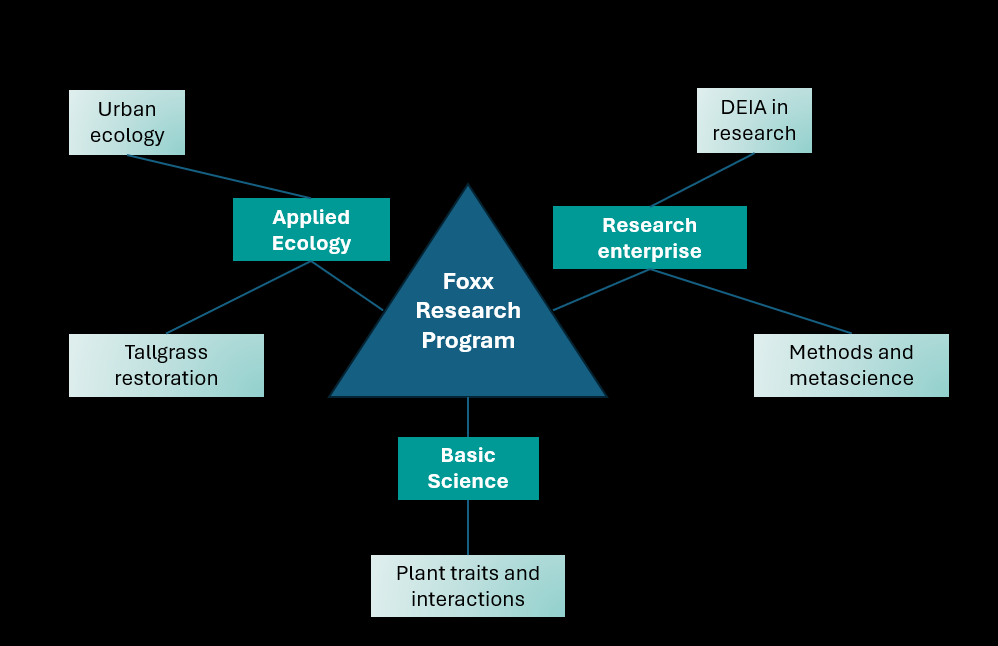

# The Foxx Disrupting Ecology Lab

I'm a Conservation Scientist at the [Chicago Botanic Garden](https://www.chicagobotanic.org/research) and adjunct professor at Northwestern University in the [Plant Biology and Conservation Graduate Program](https://plantbiology.northwestern.edu/). I work to understand basic and applied ecology topics using experimental studies, and synthesis and data science. I interrogate methods and best practices, ultimately to improve equity, inclusion, and reproducibility in practice.

{: style="height:150px;width:150px"}

Here's more on my work: {: style="height:600px;width:650px"}

[contact](mailto:afoxx@chicagobotanic.org)

Google scholar [profile](https://scholar.google.com/citations?user=nlWrL0YAAAAJ&hl=en)
