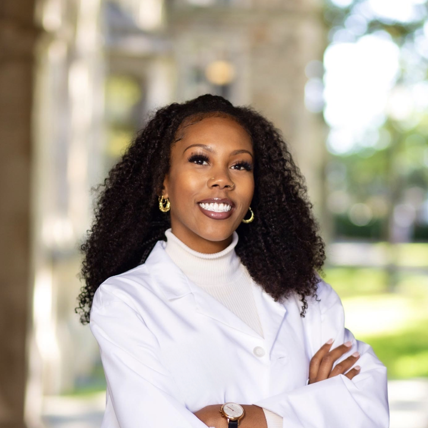
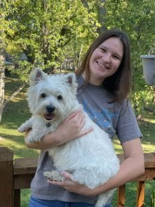
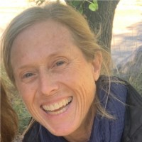
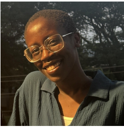
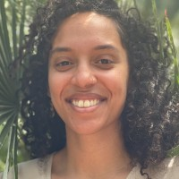
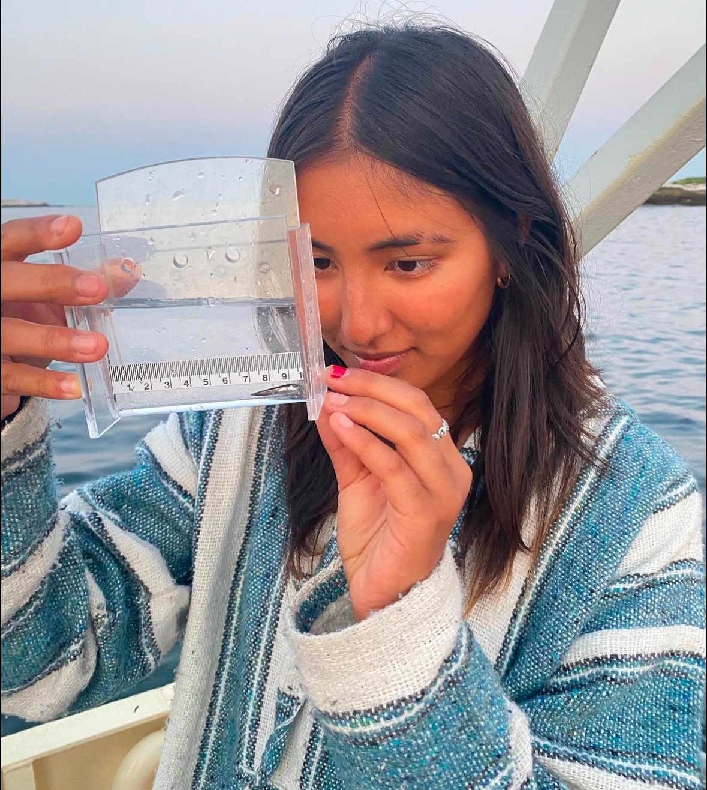

### Foxx lab members

**Postdoctoral researchers**

[Dr. Nia Johnson](https://niajohnson.info/) - sCORE synthesis projects

**Graduate Students**

Teagan LeVar - MS student (NRR BII - population variation in little Blue stem)

Tayah Carlisle - MS student (urban soils and restorations)

**Lab and Field Manager**

[Liz Vogel](https://www.northbranchnatives.com/)

**Research assistants**

Sofia Al-Shayeb

Cathy Apolot

Amelia Renner

Samantha Rosa

Nia Suresh

**Volunteers**

Camilla Mancini, Norbaya Durr, Rachel Warner, Anica Diaz, Jonnithan White, Samaher Nassar 

### Past members
**NSF REU Interns**

Moira Newman, Kiera Carpenter

**CBG College first - High school students**

Lia Hudson 
Meah Johnson 
