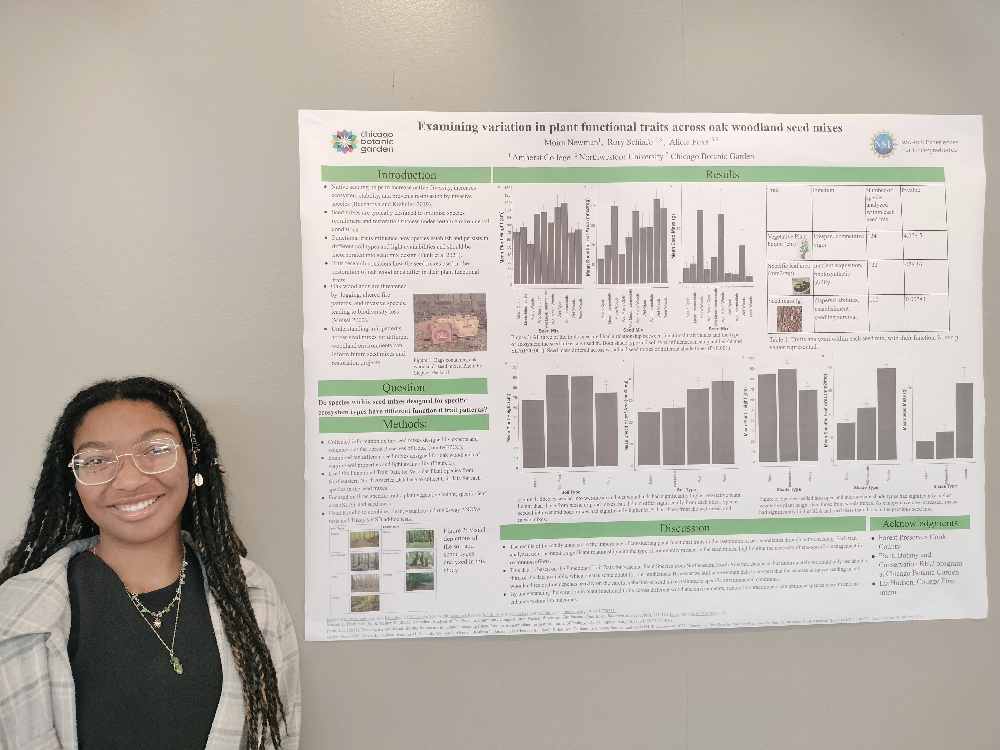
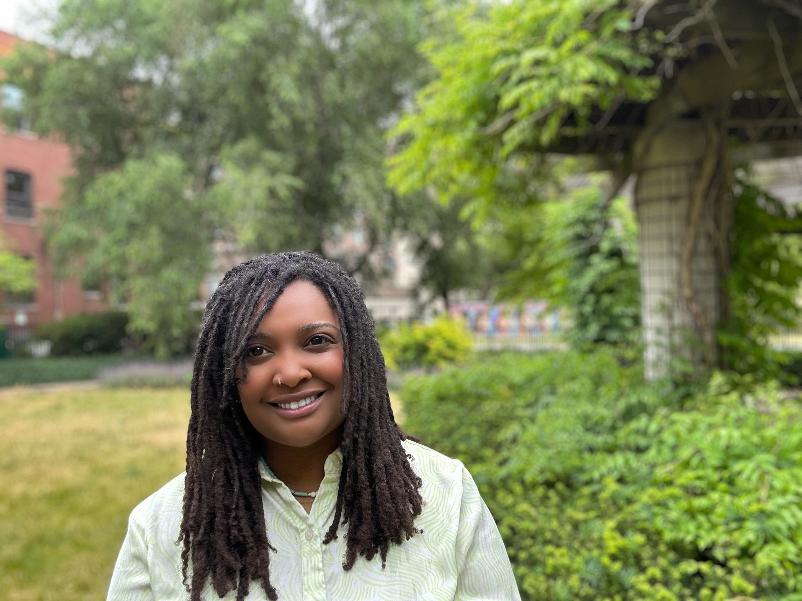
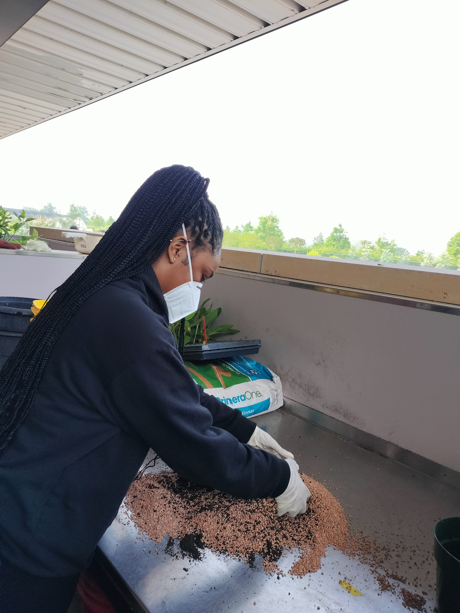

### Foxx lab members

**Postdoctoral researchers**

[Dr. Nia Johnson](https://niajohnson.info/) - sCORE [synthesis research](https://score.nipcsa.com/broadening-restoration)

{: style="height:150px;width:150px"}

**Masters Students**

Teagan LeVar

{: style="height:150px;width:150px"}

Tayah Carlisle

{: style="height:150px;width:150px"}

**Lab and Field Manager**

[Liz Vogel](https://www.northbranchnatives.com/)

{: style="height:150px;width:150px"}

**Research assistants**

Sofia Al-Shayeb

Cathy Apolot

{: style="height:150px;width:150px"}

Amelia Renner

{: style="height:150px;width:150px"}

Samantha Rosa

{: style="height:150px;width:150px"}

Nia Suresh

{: style="height:150px;width:150px"}

**Volunteers**

Camilla Mancini, Norbaya Durr, Rachel Warner, Anica Diaz, Jonnithan White, Samaher Nassar 

### Past members
**NSF REU Interns**

Moira Newman

Kiera Carpenter

**CBG College first - High school students**

Lia Hudson 
Meah Johnson 

