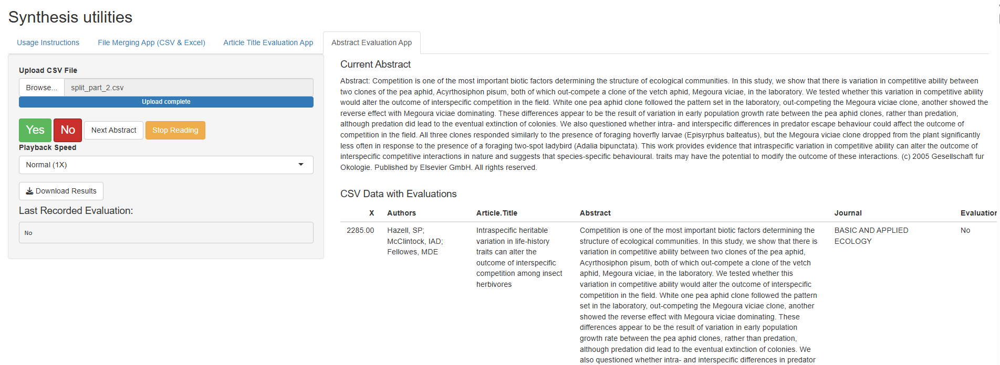

# Resources

### Foxx Lab R package

(foxxlab)[https://aliciafoxx.github.io/foxxlab/] is an R package providing a library of datasets from the Foxx Disrupting Ecology Lab, ranging from plant ecology to social science topics.

Currently, foxxlab offers a variety of datastes including meta-analysis datasets to promote open science and serve as training materials for visualizations and analyses including meta-analyses.

### Free and low-cost journals in ecology and evolution+

I assembled a non-exhaustive list of free and low-cost journals in ecology and evolution+ [here](https://docs.google.com/spreadsheets/d/1zlE6GL-kA6UxNKyDQPtcSuwyi8-TuDXM/edit#gid=1938357888). Some journals don't make this information easy to find

Here is a paper [here](https://journals.asm.org/doi/full/10.1128/mSystems.01151-21) with SI on free journals in microbiome research that also provide fee waivers for scientists from low- and middle-income countries.

Please email me if you'd like to provide an addition at afoxx[@]chicagobotanic.org

### Shiny app helper for literature screening

Shiny app file here that helps merge multiple WOS files and allows for screening of titles and abstracts with a read aloud funtion with the ability to change reading speed and to stop reading abstracts.

